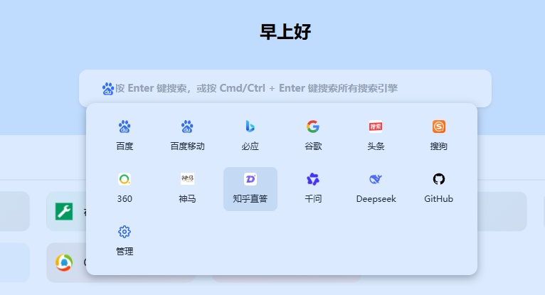
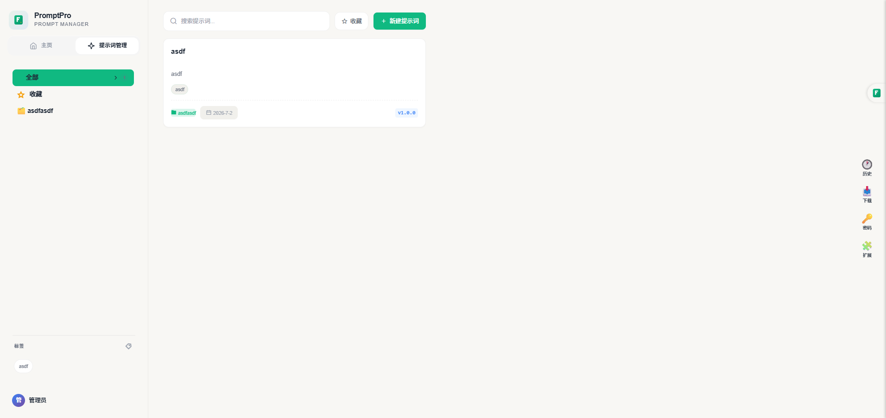

<p align="center">
  
</p>

<h1 align="center">FavsHub</h1>

<p align="center">
  
  
  
</p>

<p align="center">
  <a href="#它能做什么">功能</a> ·
  <a href="#快速上手">快速上手</a> ·
  <a href="favshub-nuxt/README.md">网站使用与部署</a> ·
  <a href="favshub-ext/README.md">浏览器扩展</a>
</p>

---

## 它能做什么

FavsHub 由 **网站** 与可选的 **浏览器扩展** 组成，面向日常「收藏 / 检索 / 提示词」场景：

| 你想… | 用什么 |
|--------|--------|
| 把书签做成卡片主页，按文件夹浏览、搜索 | 网站首页 |
| 用 Google / 百度 / ChatGPT 等一键搜、对比搜 | 顶部搜索栏（约 29 款引擎） |
| 浏览官方/公开导航合集，订阅或导入到自己的书签 | **精选集** |
| 管理 AI 提示词、版本与协作修改 | **PromptPro** |
| 把浏览器里的书签同步到网站 | **FavsHub 扩展** |
| 自己改主题、壁纸、布局；管理自己的数据 | 设置与 `/admin` 后台 |

<div align="center">
  <table>
    <tr>
      <td align="center" width="33%">
        
        <br /><em>书签卡片主页</em>
      </td>
      <td align="center" width="33%">
        
        <br /><em>多搜索引擎切换</em>
      </td>
      <td align="center" width="33%">
        
        <br /><em>AI 提示词管理</em>
      </td>
    </tr>
  </table>
</div>

---

## 仓库里有什么

```
FavsHub_web/
├── favshub-nuxt/     # 网站 → 用法与部署：favshub-nuxt/README.md
├── favshub-ext/      # 扩展 → 安装与同步：favshub-ext/README.md
├── README.md         # 本文件（使用者总览）
└── CLAUDE.md         # 仅开发者 / AI 需要（可忽略）
```

你只需要关心两份用户文档：

1. **网站** → [favshub-nuxt/README.md](favshub-nuxt/README.md)  
2. **扩展** → [favshub-ext/README.md](favshub-ext/README.md)

---

## 快速上手

### 1. 用 Docker 跑起网站（推荐）

```bash
git clone https://github.com/huanyu-a/FavsHub_web.git
cd FavsHub_web/favshub-nuxt
docker compose up -d
```

浏览器打开 **http://localhost:3090**。

- 第一个注册的用户会成为**管理员**。
- 数据默认落在 `favshub-nuxt/data/`，容器重启不会丢。
- 更完整的部署、备份、环境变量见 [网站文档 · 部署](favshub-nuxt/README.md#部署)。

### 2. （可选）安装浏览器扩展

1. 先保证网站已可访问，并完成注册登录。  
2. 按 [扩展文档](favshub-ext/README.md) 加载扩展，在扩展设置里填入网站地址与登录凭据。  
3. 一键同步浏览器书签到网站。

### 方式 B：本机开发

需已安装 Node.js ≥ 20 与 pnpm ≥ 9：

```bash
cd favshub-nuxt
pnpm install
pnpm dev          # http://localhost:3000
pnpm build        # 生产构建 → .output/
pnpm preview      # 预览生产构建
```

更完整的环境变量、备份与升级说明见 [网站文档](favshub-nuxt/README.md)。

---

## 典型使用路径

```text
打开网站主页
  → 注册 / 登录
  → 在首页浏览书签、切换搜索引擎
  → 打开「精选集」订阅或导入导航
  → 打开「提示词」管理 Prompt
  → 进入 /admin 管理自己的书签、设置、备份（管理员可管全站）
  → （可选）装扩展，把浏览器书签同步进来
```

权限一句话：

- **访客**：看公开内容（视站点配置而定）。  
- **登录用户**：管自己的书签 / 提示词 / 设置，进 `/admin` 自管。  
- **管理员**：用户、全站配置、官方精选集、备份策略等。

---

## 文档导航

| 文档 | 适合谁 | 内容 |
|------|--------|------|
| [本 README](README.md) | 所有使用者 | 产品是什么、最快怎么跑起来 |
| [favshub-nuxt/README.md](favshub-nuxt/README.md) | 站长 / 日常用户 | 网站功能、Docker 部署、环境变量、备份与安全 |
| [favshub-ext/README.md](favshub-ext/README.md) | 扩展用户 | 安装、连接站点、同步书签、权限与快捷键 |
| [favshub-nuxt/DEPLOY.md](favshub-nuxt/DEPLOY.md) | 部署运维 | 服务器信息、SSH 密钥、一键部署脚本 |
| [CLAUDE.md](CLAUDE.md) / 子目录 `CLAUDE.md` | **仅**开发者与 AI | 架构、命令、改代码约定 — **使用产品时不必阅读** |

---

## 许可证与致谢

| 部分 | 许可证 |
|------|--------|
| 网站 `favshub-nuxt/` | ISC |
| 扩展 `favshub-ext/` | AGPL-3.0 |

感谢 [TabMark-Bookmark-New-Tab](https://github.com/Alanrk/TabMark-Bookmark-New-Tab)、[TMD_Type-Markdown](https://github.com/KoniKee/TMD_Type-Markdown)，以及 Nuxt、Vue、Naive UI、WXT、better-sqlite3 等开源项目。
