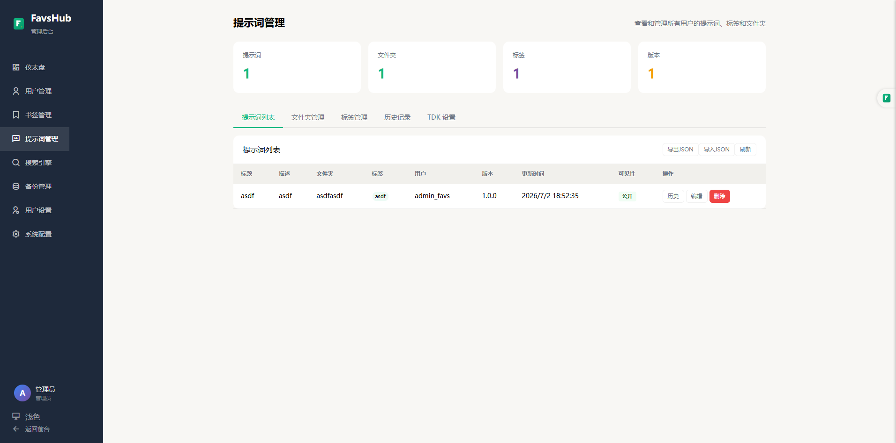
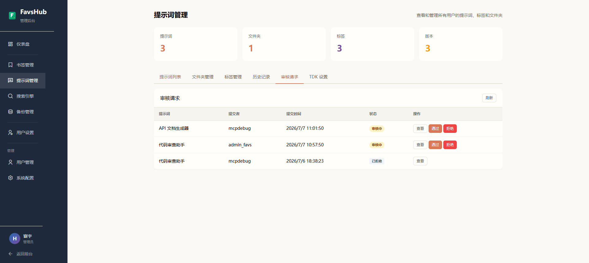
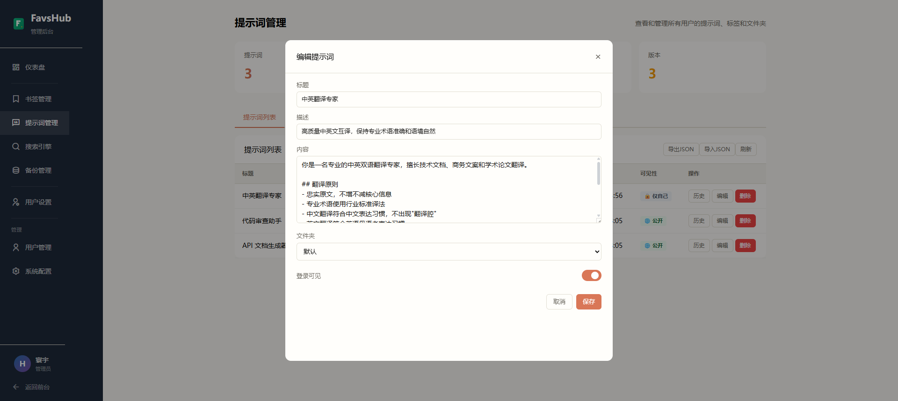
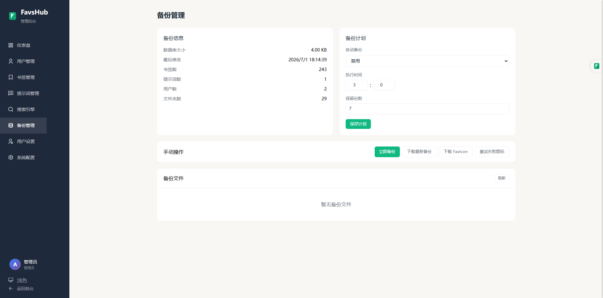
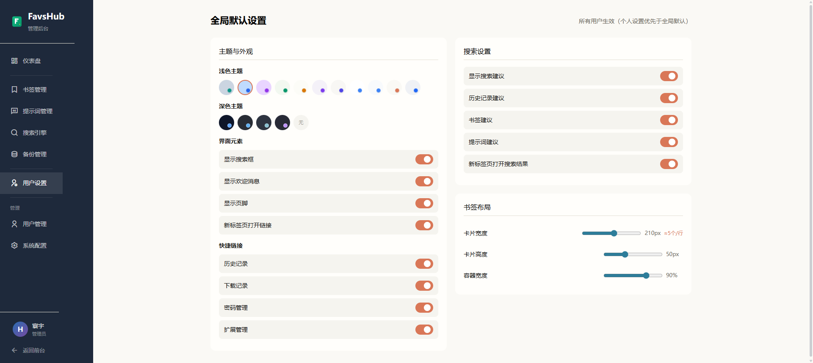
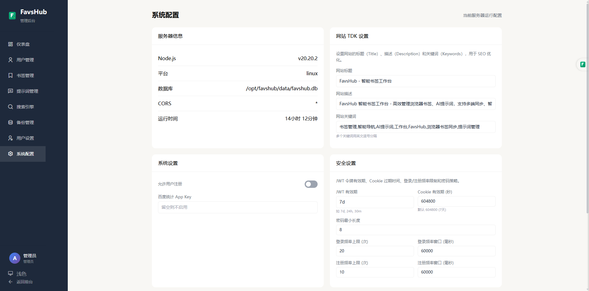

<h1 align="center">FavsHub</h1>

<p align="center">
  <strong>智能书签工作台 — 管理收藏、提示词与搜索引擎，一站式搞定</strong>
</p>

<p align="center">
  
  
  
  
  
  
</p>

<p align="center">
  <strong>15 套主题 · SSR + Nitro · 双渠道认证 · Rate Limiting · CSP 安全头</strong>
</p>

<div align="center">
  
  
</div>

---

## 目录

- [功能特性](#功能特性)
- [截图展示](#截图展示)
- [技术栈](#技术栈)
- [快速开始](#快速开始)
- [Docker 部署](#docker-部署)
- [项目结构](#项目结构)
- [认证机制](#认证机制)
- [安全特性](#安全特性)
- [API 参考](#api-参考)
- [浏览器扩展](#浏览器扩展)
- [环境变量](#环境变量)
- [License](#license)

---

## 功能特性

### 🔖 智能书签管理

- **文件夹分类** — 支持两级文件夹层级，树形导航
- **拖拽排序** — 书签和文件夹均支持拖拽调整顺序
- **标签管理** — 为书签添加彩色标签，多维筛选
- **批量操作** — 支持批量打开、批量删除
- **右键菜单** — 编辑、删除、复制、生成二维码、批量打开
- **默认首页** — 可设置任意文件夹为默认首页

### 📝 AI 提示词管理（PromptPro）

- **版本控制** — 自动保存历史版本，支持差异对比和一键还原
- **语义化版本** — 自动递增（1.0.0 → 1.0.1 → 1.1.0）
- **文件夹分类** — 多级文件夹组织提示词库
- **标签筛选** — 多维标签系统，快速定位
- **收藏功能** — 标记常用提示词
- **智能搜索** — 权重评分算法，精准匹配
- **协作审核** — 非管理员可对管理员创建的公开提示词提交修改请求，管理员审核通过后自动应用并创建新版本

### 🔍 搜索引擎聚合

- **29 款内置引擎** — 通用搜索（Google/Bing/百度）、AI 搜索（ChatGPT/Claude/DeepSeek/Kimi）、社交媒体
- **一键切换** — 下拉菜单快速切换搜索引擎
- **对比搜索** — 一键在多个引擎中同时查询
- **自定义引擎** — 管理员可添加/编辑/删除引擎
- **拖拽排序** — 自定义引擎显示顺序
- **用户提交** — 非管理员可提交搜索引擎供管理员审核

### 🎨 个性化外观

- **15 套主题** — 浅色/暗色/壁纸背景，完整配色方案
- **主题切换** — 跟随系统或手动切换，实时预览
- **壁纸系统** — 必应每日壁纸 + 预设壁纸 + 用户上传
- **布局自定义** — 书签卡片宽度/高度、容器宽度比例调节
- **移动端适配** — 响应式布局，完美适配手机/平板

### 🌐 多用户与权限

- **多用户支持** — 独立用户数据隔离
- **管理员系统** — 首个注册用户自动成为管理员
- **环境变量配置** — 支持 `ADMIN_USERS` 预设管理员列表
- **登录可见** — 书签/文件夹可设置登录后可见
- **后台开放** — 所有已登录用户可访问 `/admin` 管理自己的数据，管理员可管理全站数据

### 🐳 部署与运维

- **Docker 一键部署** — Docker Compose 快速启动
- **CI/CD 自动构建** — GitHub Actions 自动构建推送
- **数据持久化** — SQLite 数据库挂载卷，容器重建不影响数据
- **定时备份** — 支持每日自动备份 + 手动备份
- **百度网盘备份** — 云端备份支持（需 Chrome 扩展环境）
- **健康检查** — `/api/health` 端点实时监控

---

## 截图展示

### 前台页面

<div align="center">
  <table>
    <tr>
      <td align="center" width="50%">
        <a href="docs/screenshots/homepage.png">
          
        </a>
        <br />
        <em>首页 — 访客视图，搜索栏 + 文件夹侧栏 + 书签网格</em>
      </td>
      <td align="center" width="50%">
        <a href="docs/screenshots/homepage-logged-in.png">
          
        </a>
        <br />
        <em>登录后首页 — 用户面板 + 书签全文展示</em>
      </td>
    </tr>
    <tr>
      <td align="center" width="50%">
        <a href="docs/screenshots/search-engine-panel.png">
          
        </a>
        <br />
        <em>搜索引擎选择面板 — 一键切换 29 款引擎</em>
      </td>
      <td align="center" width="50%">
        <a href="docs/screenshots/login.png">
          
        </a>
        <br />
        <em>登录页 — 品牌展示，登录表单</em>
      </td>
    </tr>
    <tr>
      <td align="center" width="50%">
        <a href="docs/screenshots/prompts.png">
          
        </a>
        <br />
        <em>提示词管理 — 文件夹分类管理 AI 提示词</em>
      </td>
      <td align="center" width="50%"></td>
    </tr>
  </table>
</div>

### 管理后台

<div align="center">
  <table>
    <tr>
      <td align="center" width="50%">
        <a href="docs/screenshots/admin-dashboard.png">
          
        </a>
        <br />
        <em>仪表盘 — 统计概览 + 快捷操作入口</em>
      </td>
      <td align="center" width="50%">
        <a href="docs/screenshots/admin-users.png">
          
        </a>
        <br />
        <em>用户管理 — 查看和管理所有注册用户</em>
      </td>
    </tr>
    <tr>
      <td align="center" width="50%">
        <a href="docs/screenshots/admin-bookmarks.png">
          
        </a>
        <br />
        <em>书签管理 — 全局书签列表、筛选与维护</em>
      </td>
      <td align="center" width="50%">
        <a href="docs/screenshots/admin-prompts.png">
          
        </a>
        <br />
        <em>提示词管理 — 所有用户的提示词和标签</em>
      </td>
    </tr>
    <tr>
      <td align="center" width="50%">
        <a href="docs/screenshots/admin-review-requests.png">
          
        </a>
        <br />
        <em>审核请求 — 非管理员提交提示词修改，管理员审核</em>
      </td>
      <td align="center" width="50%">
        <a href="docs/screenshots/admin-prompt-edit.png">
          
        </a>
        <br />
        <em>提示词编辑器 — 版本管理、标签、可见性设置</em>
      </td>
    </tr>
    <tr>
      <td align="center" width="50%">
        <a href="docs/screenshots/admin-backup.png">
          
        </a>
        <br />
        <em>备份管理 — 数据自动备份 + 手动备份 + 下载</em>
      </td>
      <td align="center" width="50%">
        <a href="docs/screenshots/admin-settings.png">
          
        </a>
        <br />
        <em>用户设置 — 主题、布局、全局默认配置</em>
      </td>
    </tr>
    <tr>
      <td align="center" width="50%">
        <a href="docs/screenshots/admin-config.png">
          
        </a>
        <br />
        <em>系统配置 — JWT、注册开关、SEO、运行状态</em>
      </td>
      <td align="center" width="50%">
        <a href="docs/screenshots/search-engines.png">
          
        </a>
        <br />
        <em>搜索引擎管理 — 29 款内置引擎，拖拽排序</em>
      </td>
    </tr>
  </table>
</div>

---

## 技术栈

### 前端

| 技术 | 版本 | 说明 |
|------|------|------|
| [Nuxt 3](https://nuxt.com/) | 3.21 | Vue 全栈框架（SSR，Nitro 服务端预设） |
| [Vue 3](https://vuejs.org/) | 3.5 | 响应式 UI 框架 |
| [Naive UI](https://www.naiveui.com/) | 2.44 | 组件库 |
| [TypeScript](https://www.typescriptlang.org/) | 5.9 | 类型安全 |
| [Pinia](https://pinia.vuejs.org/) | 3.0 | 状态管理 |
| [Drizzle ORM](https://orm.drizzle.team/) | 0.45 | 数据库 ORM |

### 后端

| 技术 | 版本 | 说明 |
|------|------|------|
| [Nitro](https://nitro.unjs.io/) | 2.13 | Nuxt 服务端引擎 |
| [better-sqlite3](https://github.com/WiseLibs/better-sqlite3) | 12.10 | SQLite 数据库驱动（WAL 模式） |
| [JWT](https://jwt.io/) | 9.0 | 身份认证（jsonwebtoken + bcryptjs） |

### DevOps

| 技术 | 说明 |
|------|------|
| [Docker](https://www.docker.com/) | 容器化部署（node:20-alpine） |
| [GitHub Actions](https://github.com/features/actions) | CI/CD 自动构建 |

### 包管理器

| 技术 | 版本 |
|------|------|
| [pnpm](https://pnpm.io/) | 9.15 |

---

## 快速开始

### 环境要求

- Node.js >= 20
- pnpm >= 9

### 安装与启动

```bash
# 进入目录
cd favshub-nuxt

# 安装依赖
pnpm install

# 开发模式启动（默认端口 3000）
pnpm dev
```

首次启动会自动创建 SQLite 数据库文件 `data/favshub.db` 并初始化表结构。JWT 密钥自动生成并持久化到 `data/.jwt-secret`。注册的第一个用户自动成为管理员。

### 生产构建

```bash
pnpm build
pnpm preview    # 本地预览生产构建
```

---

## Docker 部署

使用 Docker Compose 一键部署（项目根目录已提供 `compose.yaml`）：

```yaml
services:
  favshub:
    image: ghcr.io/huanyu-a/favshub:latest
    pull_policy: if_not_present
    environment:
      - TZ=Asia/Shanghai
      - NUXT_JWT_SECRET=${NUXT_JWT_SECRET:-}
      - NUXT_DB_PATH=/opt/favshub/data/favshub.db
      - NUXT_CORS_ORIGIN=${NUXT_CORS_ORIGIN:-}
      - NUXT_ADMIN_USERS=${NUXT_ADMIN_USERS:-}
    dns:
      - 119.29.29.29
      - 223.5.5.5
    volumes:
      - ./data:/opt/favshub/data
    ports:
      - "3090:3000"
    restart: always
```

启动服务：

```bash
docker compose up -d
```

应用默认在 `http://localhost:3090` 访问。

首次部署后，第一个注册的用户自动成为管理员。JWT 密钥留空时首次启动自动生成 48 字节随机密钥并持久化到 `data/.jwt-secret`，生产环境建议通过环境变量 `NUXT_JWT_SECRET` 覆盖。

### 本地构建 Docker 镜像

```bash
cd favshub-nuxt

# 1. 构建 Nuxt 应用
npx nuxt build

# 2. 构建 Docker 镜像
bash build.sh

# 3.（可选）推送到 GHCR
docker tag favshub:latest ghcr.io/huanyu-a/favshub:latest
docker push ghcr.io/huanyu-a/favshub:latest
```

`build.sh` 会准备 Docker 构建上下文（拷贝 `.output/server` 和 `.output/public`），然后执行 `docker build`。

### GitHub Actions 自动构建

每次推送 `favshub-nuxt/VERSION` 文件修改到 `main` 分支时，GitHub Actions 自动执行：

1. 安装依赖并构建 Nuxt 应用（`pnpm install --frozen-lockfile` + `pnpm build`）
2. 准备 Docker 构建上下文（拷贝 `.output/server` 和 `.output/public`）
3. 构建并推送 Docker 镜像到 `ghcr.io/huanyu-a/favshub`
4. 打标签：版本号标签、`latest` 标签、Git SHA 标签

---

## 项目结构

```
favshub-nuxt/
├── app.vue                  # 应用入口（NuxtLayout + NuxtPage）
├── error.vue                # 错误页面（404/500）
├── nuxt.config.ts           # Nuxt 配置（Pinia 模块、Theme 系统）
├── package.json             # 依赖与脚本
├── compose.yaml             # Docker Compose 编排
├── Dockerfile               # Docker 镜像构建
├── VERSION                  # 版本号（推送此文件触发 CI）
├── docs/
│   └── screenshots/         # 文档截图
├── public/
│   ├── css/
│   │   ├── tokens.css       # CSS 设计令牌
│   │   ├── themes.css       # 15 套主题配色方案
│   │   ├── main-bundle.css  # 主样式
│   │   ├── admin.css        # 管理后台样式
│   │   ├── promptpro-bundle.css  # 提示词页面样式
│   │   ├── error.css        # 错误页面样式
│   │   └── mobile-responsive.css  # 移动端响应式
│   ├── images/              # 搜索引擎 logo、favicon 缓存
│   ├── fonts/               # 自定义字体
│   └── vendor/              # 第三方库（remixicon 图标库）
├── components/
│   ├── auth/LoginDialog.vue         # 登录弹窗
│   ├── bookmark/                    # 书签组件
│   │   ├── BookmarkCard.vue / BookmarkContextMenu.vue
│   │   ├── BookmarkEditDialog.vue / BookmarkGrid.vue
│   ├── common/IconPicker.vue        # 图标选择器
│   ├── mobile/                      # 移动端组件
│   │   ├── MobileBottomNav.vue / MobileHeader.vue / MobileOverlay.vue
│   ├── prompts/PromptDialogs.vue    # 提示词编辑弹窗
│   ├── search/
│   │   ├── SearchBar.vue            # 搜索栏
│   │   └── SearchEngineDropdown.vue # 搜索引擎下拉切换
│   ├── sidebar/
│   │   ├── FolderTreeItem.vue       # 文件夹树节点
│   │   ├── Sidebar.vue              # 侧边栏
│   │   └── UserPanel.vue            # 用户面板
│   ├── BackToTop.vue                # 回到顶部按钮
│   ├── FloatingNav.vue              # 浮动导航
│   ├── WelcomeMessage.vue           # 欢迎信息
│   └── YearProgress.vue             # 年度进度组件
├── composables/
│   ├── useAuth.ts                   # 认证逻辑
│   ├── useMobile.ts                 # 移动端检测
│   └── useTheme.ts                  # 主题系统（15 套主题切换）
├── layouts/
│   ├── admin.vue                    # 管理后台布局
│   └── default.vue                  # 默认布局（主应用）
├── middleware/
│   └── admin.ts                     # 路由守卫 — 登录权限保护
├── pages/
│   ├── index.vue                    # 首页 — 书签浏览
│   ├── login.vue                    # 登录/注册页
│   ├── prompts/index.vue            # 提示词管理页
│   └── admin/                       # 管理后台（SPA）
│       ├── index.vue                # 📊 仪表盘
│       ├── users.vue                # 📋 用户管理
│       ├── bookmarks.vue            # 📋 书签管理
│       ├── prompts.vue              # 📋 提示词管理
│       ├── search-engines.vue       # 🔍 搜索引擎管理
│       ├── backup.vue               # 💾 备份管理
│       ├── settings.vue             # ⚙️ 用户设置
│       └── config.vue               # ⚙️ 系统配置
├── plugins/
│   ├── 0.theme-init.client.ts       # 主题初始化（启动时恢复）
│   └── auth-init.client.ts          # 认证初始化（启动时恢复 token）
├── stores/
│   ├── auth.ts                      # 认证状态
│   ├── bookmarks.ts                 # 书签数据
│   ├── searchEngines.ts             # 搜索引擎列表
│   ├── settings.ts                  # 用户设置
│   └── ui.ts                        # UI 状态
├── server/
│   ├── api/                         # API 路由
│   │   ├── auth/                    # 登录/注册/登出
│   │   ├── bookmarks/               # 书签 CRUD + 排序 + 导出
│   │   ├── folders/                 # 文件夹管理
│   │   ├── prompts/                 # 提示词 CRUD + 版本 + 文件夹 + 审核
│   │   │   └── [id]/review-request.post.ts  # 提交审核请求
│   │   ├── tags/                    # 标签 CRUD
│   │   ├── sync/                    # 扩展数据同步 + favicon
│   │   ├── settings/                # 用户设置 + 默认设置
│   │   ├── admin/                   # 管理员后台 API
│   │   │   ├── backup/              # 备份管理（下载/信息）
│   │   │   ├── bookmarks/           # 书签管理
│   │   │   ├── config/              # 系统配置
│   │   │   ├── folders/             # 文件夹管理
│   │   │   ├── prompt-folders/      # 提示词文件夹
│   │   │   ├── prompts/             # 提示词管理 + 审核请求
│   │   │   │   └── review-requests/ # 审核请求列表 + 批准/拒绝
│   │   │   ├── search-engines/      # 搜索引擎管理
│   │   │   ├── tags/                # 标签管理
│   │   │   ├── users/               # 用户管理
│   │   │   ├── stats.get.ts         # 统计数据
│   │   │   ├── manual-backup.post.ts
│   │   │   ├── backup-schedule.get/put.ts  # 备份计划
│   │   │   ├── backup-files.get.ts  # 备份文件列表
│   │   │   ├── download-favicon/    # favicon 下载本地化
│   │   │   ├── force-localize-icons.post.ts
│   │   │   └── retry-failed-favicons.post.ts
│   │   ├── search-engines.get.ts    # 搜索引擎列表（公开）
│   │   ├── health.get.ts            # 健康检查
│   │   ├── config/registration.get.ts  # 注册开关
│   │   ├── tdk.get.ts               # TDK 配置
│   │   ├── tdk/promptpro.get.ts     # PromptPro TDK
│   │   └── user/                    # 用户统计
│   ├── middleware/
│   │   ├── admin-guard.ts           # 服务端管理员 JWT 验证
│   │   └── cors.ts                  # CORS 中间件
│   ├── plugins/
│   │   ├── db-init.ts               # 数据库初始化（首次启动建表）
│   │   ├── theme-init.ts            # 服务端主题注入
│   │   ├── error-handler.ts         # 全局错误处理
│   │   └── backup-scheduler.ts      # 定时备份
│   ├── database/
│   │   ├── index.ts                 # 数据库连接（better-sqlite3）
│   │   ├── schema.ts                # Drizzle ORM Schema
│   │   └── migrate.ts               # 增量迁移
│   └── utils/
│       ├── auth.ts                  # JWT 工具（verifyToken + requireAuth）
│       ├── jwt.ts                   # JWT 签发/验证
│       ├── config.ts                # 配置（JWT 密钥、CORS）
│       ├── constants.ts             # 常量（默认搜索引擎等）
│       └── rate-limit.ts            # 速率限制
├── data/                            # SQLite 数据库（gitignore）
└── .output/                         # Nuxt 构建输出（gitignore）
```

---

## 安全特性

### HTTP 安全头

通过 `nuxt.config.ts` 的 `nitro.routeRules` 统一配置：

| 安全头 | 值 | 说明 |
|--------|-----|------|
| `X-Content-Type-Options` | `nosniff` | 防止 MIME 类型嗅探 |
| `X-Frame-Options` | `DENY` | 禁止页面被嵌入 iframe（防点击劫持） |
| `Referrer-Policy` | `strict-origin-when-cross-origin` | 限制 Referrer 泄露 |
| `X-XSS-Protection` | `1; mode=block` | XSS 过滤 |
| `Strict-Transport-Security` | `max-age=31536000; includeSubDomains` | HSTS 强制 HTTPS |
| `Content-Security-Policy` | 完整 CSP 策略 | 限制脚本/样式/图片/字体来源 |

### Rate Limiting

- **登录接口** — 默认 60 秒内最多 20 次请求（可配置 `rate_limit_login_max` / `rate_limit_login_window`）
- **注册接口** — 默认 60 秒内最多 10 次请求（可配置 `rate_limit_register_max` / `rate_limit_register_window`）
- **账户锁定** — 5 次登录失败后锁定 15 分钟
- **基于进程内存** — 仅适用于单实例部署，多实例需迁移到 Redis

### SSRF 防护

- Favicon 下载限制协议（仅 HTTP/HTTPS）
- 最大重定向次数限制（默认 3 次）
- 下载超时控制（默认 10 秒）
- 内网 IP 黑名单过滤

### 密码安全

- **bcrypt 哈希** — 密码使用 bcryptjs 存储
- **最小密码长度** — 可配置（默认 8 位，通过 `min_password_length` 调整）

### 错误脱敏

- 生产环境隐藏 5xx 错误详情，仅返回通用错误信息
- 全局错误处理器 `server/plugins/error-handler.ts` 统一处理

### 系统配置参数

以下安全参数通过 `system_config` 表存储，管理员可在 `/admin/config` 页面调整：

| 配置键 | 说明 | 默认值 |
|--------|------|--------|
| `jwt_token_expiry` | JWT 过期时间 | `7d` |
| `cookie_max_age` | Cookie 有效期（秒） | `604800`（7 天） |
| `rate_limit_login_max` | 登录请求限制次数 | `20` |
| `rate_limit_login_window` | 登录限制窗口（毫秒） | `60000` |
| `rate_limit_register_max` | 注册请求限制次数 | `10` |
| `rate_limit_register_window` | 注册限制窗口（毫秒） | `60000` |
| `min_password_length` | 最小密码长度 | `8` |
| `trust_proxy` | 是否信任反向代理 | `false` |
| `max_bookmarks_per_sync` | 单次同步最大书签数 | `20000` |
| `bookmarks_query_limit` | 书签查询上限 | `500` |

---

## 认证机制

### 双渠道认证

- **httpOnly Cookie** — SSR 页面访问时自动携带，服务端中间件验证
- **Bearer Token** — 客户端 API 调用时通过 `Authorization` 头传递

### Token 存储

- 登录后同时写入：
  - `localStorage.favshub_token`（客户端读取）
  - `Set-Cookie: favshub_token=xxx`（httpOnly，SSR 用）

### 安全特性

- **secure 标志自适应** — HTTP 时 `secure: false`，HTTPS 时 `secure: true`
- **sameSite: lax** — 防止 CSRF 攻击
- **JWT 过期** — 默认 7 天（可通过系统配置 `jwt_token_expiry` 调整），过期后自动跳转登录
- **JWT 密钥持久化** — 首次启动自动生成 48 字节随机密钥，存储于 `data/.jwt-secret`，重启不丢失

### 认证流程

```
1. 用户登录 → POST /api/auth/login
2. 服务端验证 → 返回 JWT + Set-Cookie
3. 客户端保存 token → localStorage + Pinia store
4. 后续请求携带 Authorization: Bearer <token>
5. 服务端中间件验证 → 通过则放行，失败则清除 cookie 并跳转登录
```

---

## API 参考

所有路由挂载在 `/api` 前缀下：

### 公开接口（无需认证）

| 方法 | 路径 | 说明 |
|------|------|------|
| `GET` | `/api/search-engines` | 获取搜索引擎列表 |
| `GET` | `/api/health` | 健康检查 |
| `GET` | `/api/config/registration` | 获取注册开关状态 |
| `GET` | `/api/tdk` | 获取 TDK 配置 |
| `GET` | `/api/tdk/promptpro` | 获取 PromptPro TDK 配置 |
| `POST` | `/api/auth/register` | 用户注册 |
| `POST` | `/api/auth/login` | 用户登录 |

### 认证接口（需要登录）

| 方法 | 路径 | 说明 |
|------|------|------|
| `GET` | `/api/auth/me` | 获取当前用户信息 |
| `POST` | `/api/auth/logout` | 登出 |
| `PUT` | `/api/auth/profile` | 更新个人资料 |
| `GET` | `/api/bookmarks` | 获取书签列表 |
| `POST` | `/api/bookmarks` | 创建书签 |
| `PUT` | `/api/bookmarks/:id` | 更新书签 |
| `DELETE` | `/api/bookmarks/:id` | 删除书签 |
| `PUT` | `/api/bookmarks/reorder` | 书签排序 |
| `GET` | `/api/bookmarks/export` | 导出书签 |
| `GET` | `/api/folders` | 获取文件夹列表 |
| `POST` | `/api/folders` | 创建文件夹 |
| `PUT` | `/api/folders/:id` | 更新文件夹 |
| `DELETE` | `/api/folders/:id` | 删除文件夹 |
| `GET` | `/api/prompts` | 获取提示词列表 |
| `POST` | `/api/prompts` | 创建提示词 |
| `GET` | `/api/prompts/:id` | 获取提示词详情 |
| `PUT` | `/api/prompts/:id` | 更新提示词 |
| `DELETE` | `/api/prompts/:id` | 删除提示词 |
| `POST` | `/api/prompts/:id/review-request` | 提交提示词修改审核请求 |
| `GET` | `/api/prompts/:id/my-review-request` | 查询当前用户的审核状态 |
| `POST` | `/api/prompts/:id/restore` | 还原历史版本 |
| `GET` | `/api/prompts/export` | 导出提示词 |
| `GET` | `/api/prompts/folders/all` | 获取所有提示词文件夹 |
| `POST` | `/api/prompts/folders` | 创建提示词文件夹 |
| `PUT` | `/api/prompts/folders/:id` | 更新提示词文件夹 |
| `DELETE` | `/api/prompts/folders/:id` | 删除提示词文件夹 |
| `GET` | `/api/prompts/versions/:promptId` | 获取版本历史 |
| `POST` | `/api/prompts/versions/:promptId` | 创建新版本 |
| `GET` | `/api/prompts/tag-relations` | 获取提示词-标签关联 |
| `GET` | `/api/tags` | 获取标签列表 |
| `POST` | `/api/tags` | 创建标签 |
| `PUT` | `/api/tags/:id` | 更新标签 |
| `DELETE` | `/api/tags/:id` | 删除标签 |
| `GET` | `/api/settings` | 获取用户设置 |
| `PUT` | `/api/settings` | 更新用户设置 |
| `GET/PUT` | `/api/settings/default` | 默认设置读写 |
| `POST` | `/api/sync/bookmarks` | 同步浏览器书签 |
| `PUT` | `/api/sync/bookmarks` | 增量同步书签 |
| `GET` | `/api/sync/bookmarks/since` | 获取增量同步数据 |
| `GET` | `/api/sync/bookmarks/full` | 获取全量同步数据 |
| `POST` | `/api/sync/favicons` | 同步 favicon |
| `GET` | `/api/user/stats` | 获取用户统计 |

### 管理员接口（需要管理员权限）

| 方法 | 路径 | 说明 |
|------|------|------|
| `GET` | `/api/admin/stats` | 获取全站统计数据 |
| `GET` | `/api/admin/users` | 获取用户列表 |
| `PUT` | `/api/admin/users/:id` | 更新用户信息 |
| `DELETE` | `/api/admin/users/:id` | 删除用户 |
| `GET` | `/api/admin/users/:id/bookmarks` | 获取指定用户书签 |
| `GET` | `/api/admin/users/:id/prompts` | 获取指定用户提示词 |
| `GET` | `/api/admin/bookmarks` | 获取所有书签 |
| `PUT` | `/api/admin/bookmarks/:id` | 更新任意书签 |
| `DELETE` | `/api/admin/bookmarks/:id` | 删除任意书签 |
| `GET` | `/api/admin/bookmarks/export` | 导出所有书签 |
| `GET` | `/api/admin/folders` | 获取所有文件夹 |
| `POST` | `/api/admin/folders` | 创建文件夹 |
| `PUT` | `/api/admin/folders/:id` | 更新文件夹 |
| `DELETE` | `/api/admin/folders/:id` | 删除文件夹 |
| `PUT` | `/api/admin/folders/reorder` | 文件夹排序 |
| `GET` | `/api/admin/prompts` | 获取所有提示词 |
| `PUT` | `/api/admin/prompts/:id` | 更新任意提示词 |
| `DELETE` | `/api/admin/prompts/:id` | 删除任意提示词 |
| `GET` | `/api/admin/prompts/history` | 提示词操作历史 |
| `GET` | `/api/admin/prompts/review-requests` | 获取审核请求列表 |
| `POST` | `/api/admin/prompts/review-requests/:id/approve` | 审核通过 |
| `POST` | `/api/admin/prompts/review-requests/:id/reject` | 审核拒绝 |
| `GET` | `/api/admin/prompt-folders` | 获取所有提示词文件夹 |
| `POST` | `/api/admin/prompt-folders` | 创建提示词文件夹 |
| `PUT` | `/api/admin/prompt-folders/:id` | 更新提示词文件夹 |
| `DELETE` | `/api/admin/prompt-folders/:id` | 删除提示词文件夹 |
| `PUT` | `/api/admin/prompt-folders/reorder` | 提示词文件夹排序 |
| `GET` | `/api/admin/tags` | 获取所有标签 |
| `GET/PUT` | `/api/admin/config` | 系统配置读写 |
| `GET/POST/PUT/DELETE` | `/api/admin/search-engines/*` | 搜索引擎管理 |
| `GET` | `/api/admin/backup/info` | 获取备份信息 |
| `GET` | `/api/admin/backup/download` | 下载备份文件 |
| `POST` | `/api/admin/manual-backup` | 手动备份 |
| `GET/PUT` | `/api/admin/backup-schedule` | 备份计划读写 |
| `GET` | `/api/admin/backup-files` | 获取备份文件列表 |
| `POST` | `/api/admin/download-favicon/:id` | 下载单个 favicon |
| `POST` | `/api/admin/download-favicons` | 批量下载 favicon |
| `POST` | `/api/admin/force-localize-icons` | 强制本地化图标 |
| `POST` | `/api/admin/retry-failed-favicons` | 重试失败 favicon |
| `POST` | `/api/admin/sync-prompts` | 同步提示词 |

### 请求头格式

```http
Authorization: Bearer <favshub_token>
Content-Type: application/json
```

---

## 浏览器扩展

FavsHub 配套的浏览器扩展位于项目根目录的 `favshub-ext/`，基于 **Vue 3 + WXT + TypeScript** 构建。

主要功能：

- **一键收藏** — 右键或点击扩展图标快速收藏当前网页
- **增量同步** — 自动同步书签到 FavsHub 服务器，URL 去重
- **侧边栏模式** — `Alt+B` 快速打开侧边栏
- **浮动球** — 页面悬浮球快速访问
- **跨浏览器** — Chrome（MV3）和 Firefox
- **国际化** — 中文 / English 双语支持

```bash
cd favshub-ext
pnpm install
pnpm dev           # Chrome 开发模式
pnpm build         # Chrome 生产构建
pnpm build:firefox # Firefox 生产构建
```

详见 [favshub-ext/README.md](../favshub-ext/README.md)。主题配色参考了 [TMD_Type-Markdown](https://github.com/KoniKee/TMD_Type-Markdown) 项目（见 `TMD_ref/` 目录）。

---

## 环境变量

| 变量 | 说明 | 默认值 |
|------|------|--------|
| `NUXT_JWT_SECRET` | JWT 签名密钥。留空则首次启动自动生成并持久化到 `data/.jwt-secret` | 自动生成（48 字节随机） |
| `NUXT_DB_PATH` | SQLite 数据库文件路径 | `./data/favshub.db` |
| `NUXT_CORS_ORIGIN` | CORS 允许的跨域来源 | `http://localhost:3000` |
| `NUXT_ADMIN_USERS` | 管理员用户名列表（逗号分隔） | 空（首个注册用户为管理员） |
| `NUXT_TRUST_PROXY` | 是否信任反向代理的 X-Forwarded-For（生产环境使用 Nginx 反代时设为 `true`） | `false` |

---

## License

ISC License
